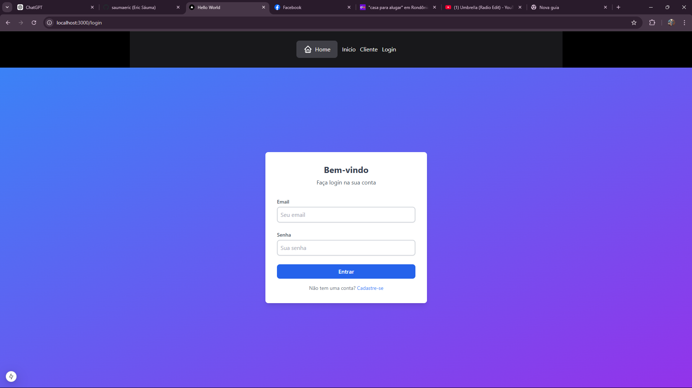
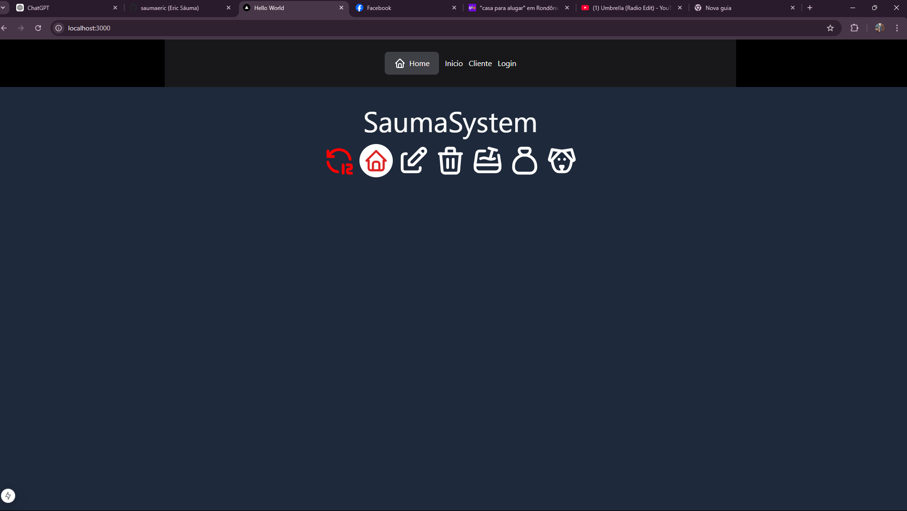

### Paginas criadas

#### Login


#### Home


### Criando um novo Projeto em Frontend saumasystem 

* npx create-next-app@latest saumasystem
* cd saumasystem
* npm rum dev

#### Bibliotecas usadas
* icons
```
npm install  @tabler/icons-react
```

### Salvando no git

* git add .
* git commit -m "iniciando ico"
* git push